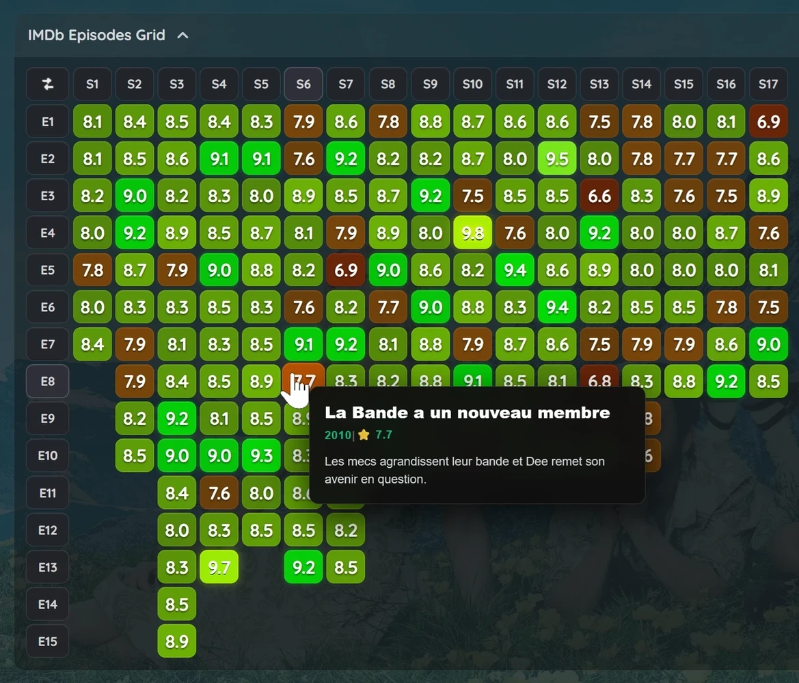

# Jellyfin Episodes Ratings Grid 🟧🟨🟩🟩

Display the IMDb episodes ratings heatmap grid on Jellyfin TV Series pages.
The userscript adds the grid to TV Shows pages between Seasons and Cast, inside a drop-down section that stays closed by default to avoid spoilers.

<p align="center">
  <br>
</p>

## Features

- **Heatmap-style** graph ratings chart
- **Drop-down menu to avoid spoilers** at opening the TV series pages
- **Fast access** : Episodes and seasons cells are linked to the library
- **Top-left button to invert the grid layout (Seasons ↔ Episodes)**. Preference saved locally
- **Custom themes** & backgrounds compatibility
- **Highlights** the matching season number and episode number when hovering a cell
- **Compact layout**, display up to 26 episodes and 26 seasons without scrolling on desktop
- **Mobile-friendly** & Sticky episode number column during horizontal scrolling
- Heatmap data are **loaded only after clicking the drop-down menu**
- Compatibility to use with HoverDetails script distributed through [**JellyFrame plugin**, thanks @grimmdev](https://github.com/Jellyfin-PG/JellyFrame))
- IMDb ratings thanks to [@ya0903 dataset](https://github.com/ya0903/imdb-episode-dataset), fallback to Jellyfin metadata when the dataset has no rating
- Alternative local script: everything is handled locally, only using ratings metadata fetched directly from the Jellyfin server

## Transparency

- Heavily LLM-assisted
- Human involvement was required to optimize the process, despite JavaScript repeatedly trying to hurt the human.

## Requirements

- [**Jellyfin JavaScript Injector plugin**](https://github.com/n00bcodr/Jellyfin-JavaScript-Injector)
####  Or
- [**JellyFrame plugin**](https://github.com/Jellyfin-PG/JellyFrame)

## Screenshots


**Drop-down menu**

<br>


**Sticky column & Highlights**

<br>

## Installation

#### **- Alternative installation : available through [JellyFrame plugin](https://github.com/Jellyfin-PG/JellyFrame)**

#### 1. Install the *Jellyfin JavaScript Injector* plugin in your Jellyfin server if it is not already installed (may need server reboot).

#### 2. Open the Jellyfin admin ***dashboard***

#### 3. Go to: ***Dashboard*** => ***JS Injector***

#### 4. ***Add Script*** => Name it *imdb-grid* or whatever => Copy/Paste :
```
(() => {
  const s = document.createElement("script");
  s.src = "https://cdn.jsdelivr.net/gh/Damocles-fr/jellyfin-imdb-episodes-heatmap-ratings-grid@latest/Jellyfin-Episodes-Ratings-Grid-JF-Library-Links.js";
  s.async = true;
  (document.head || document.documentElement).appendChild(s);
})();
```

###### Alternative script : use only JF server CommunityRating metadata, no IMDb online dataset, everything local, copy/paste this script instead : [Local-CommunityRating-Metadata-Only.js](https://raw.githubusercontent.com/Damocles-fr/jellyfin-imdb-episodes-heatmap-ratings-grid/refs/heads/main/Jellyfin-Episodes-Ratings-Grid-Local-CommunityRating-Metadata-Only.js)

#### 5. Click ***Enabled*** => Click ***Save***

#### 6. Done, refresh a Jellyfin TV series page.

###### Alternatively, you can copy and paste the full script available on the GitHub rather than using cdn.jsdelivr. Note that this method does not support automatic updates. You can also install it only for your web-browser with an extension like *Violentmonkey*.

## Technical

- It won't display on Jellyfin apps that do not use the Jellyfin Web UI & JavaScript Injector or JellyFrame
- Compatible with Jellyfin 10.11 and above. Not tested on Jellyfin 10.10 and under
- Injects the graph directly into Jellyfin with the Jellyfin JavaScript Injector plugin or JellyFrame
- DOM insertion in a stable location on series page (between Seasons and cast)
- Data source : The heatmap data is loaded from the IMDb heatmap dataset by @ya0903
- Heatmap data is loaded only after clicking the drop-down menu
- When a supported series page is detected, the script requests the current Jellyfin item metadata through the local Jellyfin API and reads the **IMDb provider ID** from the item's `ProviderIds`
- When the drop-down is opened, the script fetches the corresponding JSON dataset from the IMDb heatmap dataset source (fallback to Jellyfin episode metadata when the IMDb dataset has no rating)
- If the ID's exists, the script builds the full ratings grid
- Cached requests for item metadata and external ratings dataset to reduce repeated loading
- Preferences (invert seasons ↔ episodes) and cache saved locally client-side

## Need Help?
- Don't hesitate to open an [issue](https://github.com/Damocles-fr/jellyfin-imdb-episodes-heatmap-ratings-grid/issues)
- **DM me** https://forum.jellyfin.org/u-damocles
- GitHub [**Damocles-fr**](https://github.com/Damocles-fr)
