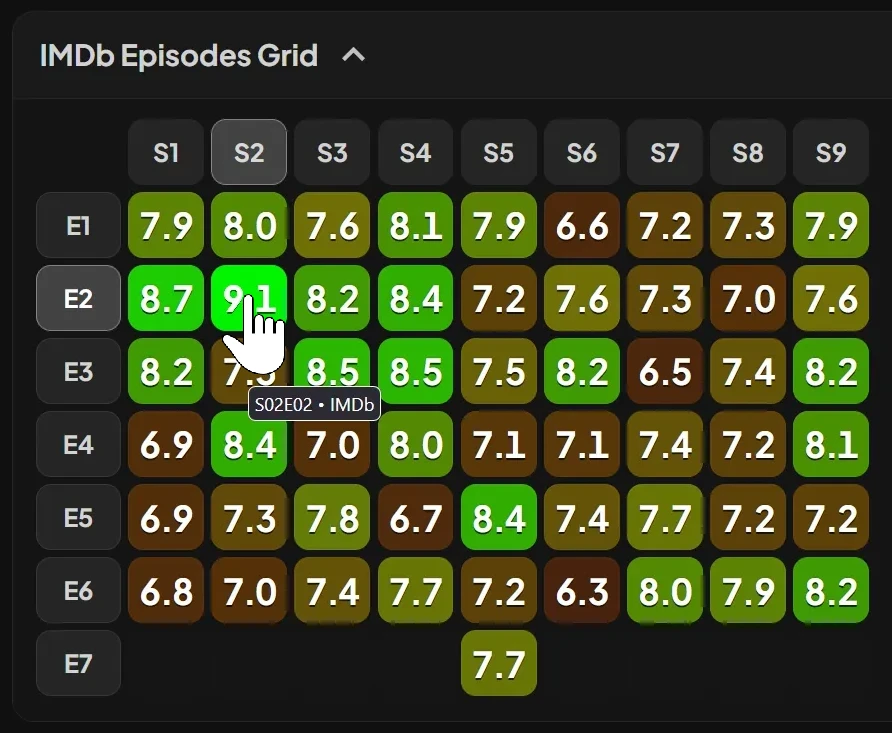
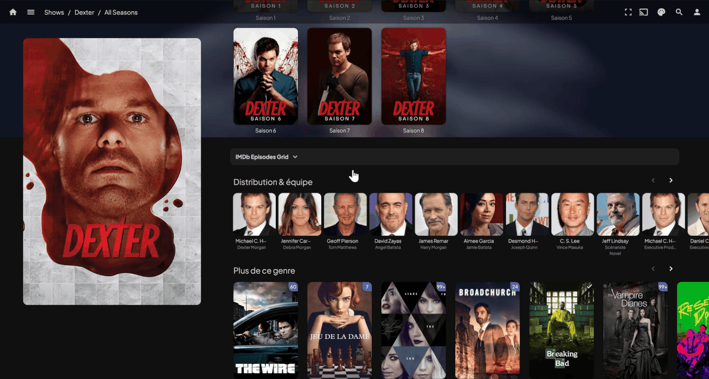
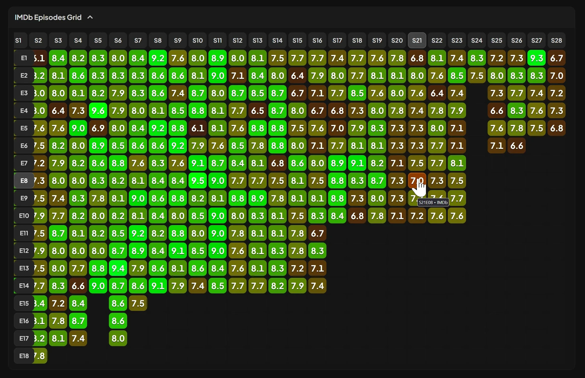
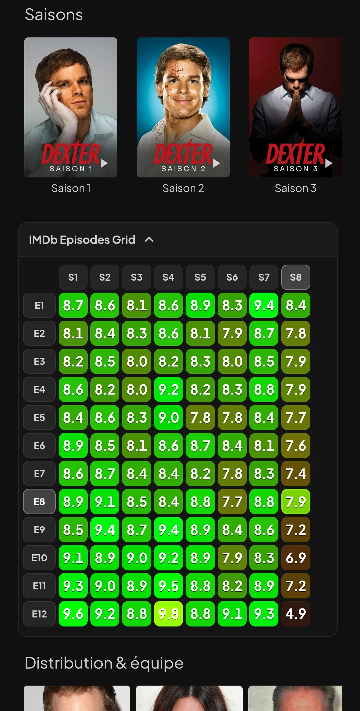

# Jellyfin Episodes Ratings Grid 🟧🟨🟩🟩

Display an IMDb episodes ratings heatmap grid on Jellyfin TV Series pages.
The script adds the grid to TV Shows pages between Seasons and Cast, inside a drop-down section that stays closed by default to avoid spoilers.

It is not compatible with Jellyfin apps that do not use the Jellyfin Web UI & JavaScript Injector

## Features

- Uses a **heatmap-style** graph ratings chart
- Rating based color styling to make strong and weak episodes easy to identify at a glance
- **Drop-down menu to avoid spoilers** at opening the TV series pages
- **Highlights** the matching season number and episode number when hovering a cell
- **Compact layout**, display up to 26 episodes and 26 seasons without scrolling on desktop
- **Mobile-friendly** layout with horizontal scroll support
- Sticky episode number column during horizontal scrolling
- Click any episode rating cell to open the corresponding IMDb episode page
- Click any season header to open the corresponding IMDb season page
- The grid links to IMDb pages instead of Jellyfin pages because IMDb and your library (TMDB) may have inconsistent numbering.
- Fallback link to the IMDb ratings page when heatmap data is not available
- Heatmap data are loaded only after clicking the drop-down menu

   

## Transparency

- This repository contains a suspicious amount of LLM code.
- Human involvement was required to optimize the process, despite JavaScript repeatedly trying to hurt the human.

## Requirements

- Jellyfin
- [Jellyfin JavaScript Injector plugin](https://github.com/n00bcodr/Jellyfin-JavaScript-Injector)
- A Jellyfin library with series that have IMDb provider IDs

## Screenshots

**Drop-down menu**

 

**Sticky column & Highlights**

 

   
  <strong>Mobile-friendly</strong>

 

## Installation

#### 1. Install the *Jellyfin JavaScript Injector* plugin in your Jellyfin server if it is not already installed (may need server reboot).

#### 2. Open the Jellyfin admin ***dashboard***

#### 3. Go to: ***Dashboard*** => ***JS Injector***

#### 4. Create a new injected script

***Add Script*** => Name it *imdb-grid* or whatever => Copy/Paste the full [.js script](https://github.com/Damocles-fr/jellyfin-imdb-episodes-heatmap-ratings-grid/releases) into the new field => Click ***Enabled*** => Click ***Save***

#### 5. Refresh the Jellyfin web interface and open a TV series page.

You should see an **IMDb Episodes Grid** drop-down section on series pages.

##### Alternatively, if you want to use it only in your web browser, or if you do not want to use the JS Injector plugin, you can install it with an extension like *Violentmonkey*.

## Technical

- It is not compatible with Jellyfin apps that do not use the Jellyfin Web UI & JavaScript Injector
- Injects the graph directly into Jellyfin with the Jellyfin JavaScript Injector plugin
- DOM insertion in a stable location on series page (between Seasons and cast)
- Data source : The heatmap data is loaded from the IMDb heatmap dataset by @mokronos
- Heatmap data is loaded only after clicking the drop-down menu
- When a supported series page is detected, the script requests the current Jellyfin item metadata through the local Jellyfin API and reads the **IMDb provider ID** from the item's `ProviderIds`.
- When the drop-down is opened, the script fetches the corresponding JSON dataset from the IMDb heatmap dataset source
- If the dataset exists, the script builds the full ratings grid
- If the dataset is missing, the script shows a fallback link to the IMDb ratings page for that series
- Cached requests for item metadata and external ratings dataset to reduce repeated loading
- Heavily LLM-assisted

## Need Help?
- Don't hesitate to open an [issue](https://github.com/Damocles-fr/jellyfin-imdb-episodes-heatmap-ratings-grid/issues)
- **DM me** https://forum.jellyfin.org/u-damocles
- GitHub [**Damocles-fr**](https://github.com/Damocles-fr)
